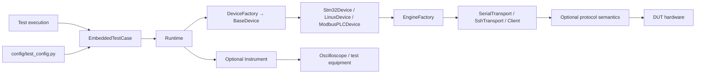
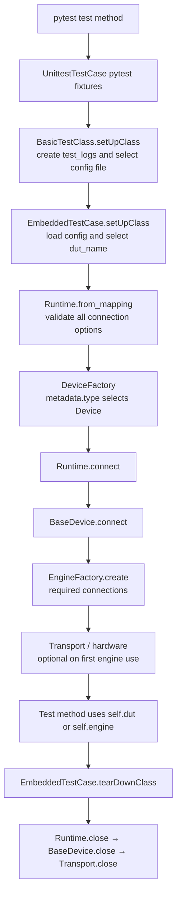
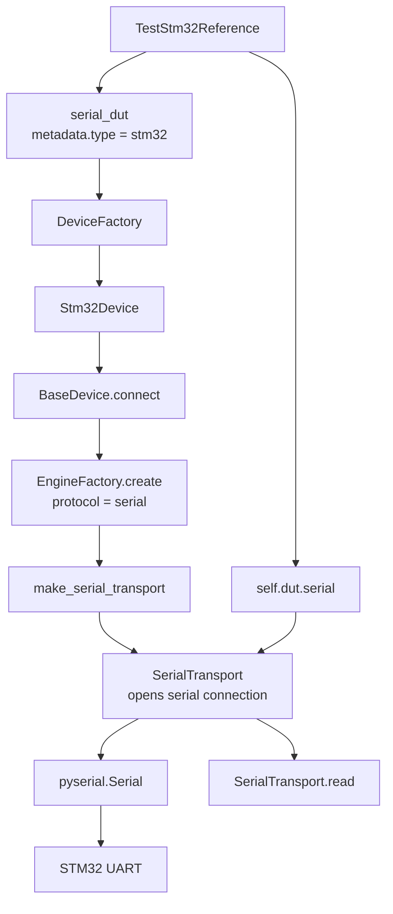
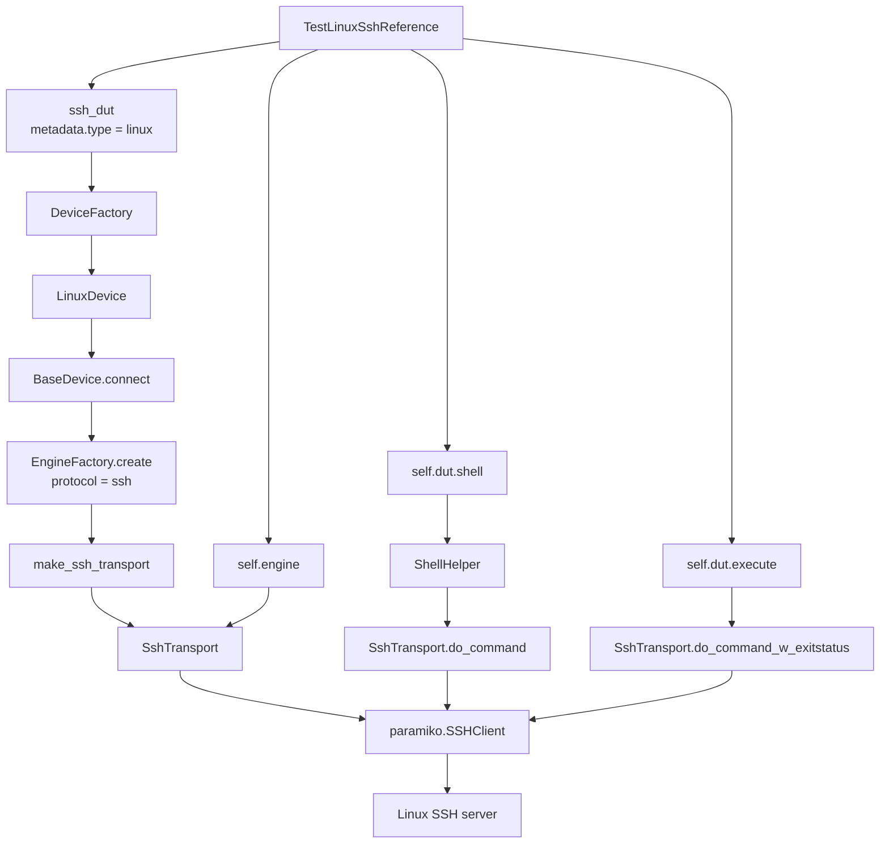

# Embedded Framework

Embedded Framework is a product-independent Python foundation for communicating
with embedded devices and initializing generic devices under test (DUTs).

It provides:

- communication clients for ADB, MQTT, SSH, FTP/FTPS, HTTP/HTTPS, TCP/UDP
  sockets, serial ports, and WebSocket;
- configuration loading from JSON or TOML, with environment-variable
  substitution;
- configuration-driven connection creation and DUT lifecycle management;
- common host, file, network, and shell helpers;
- structured logging, assertions, timeouts, timers, and polling utilities.

## Install

```bash
python -m pip install -e ./embedded_test_framework
```

For development tools:

```bash
python -m pip install -e "./embedded_test_framework[dev]"
```

## Initialize a DUT

Create a JSON or TOML configuration that declares named connections and DUTs.
Connection passwords and tokens may use `${ENVIRONMENT_VARIABLE}` values.

```python
from embedded_test_framework.runtime import initialize

with initialize("devices.toml") as runtime:
    linux = runtime.duts["target"]
    result = linux.execute("uname -a")
    print(result.stdout)
```

`execute()` is a Linux-device API. Other devices expose only their supported
operations, such as `Stm32Device.serial()` or Modbus PLC register access.

See [the communication package](communication/README.md) for the
transport interfaces and connection configuration fields.

Connections are required by default and open during `Runtime.connect()`. Set
`"required": false` for an optional connection (for example MQTT on a Linux
DUT); it is validated during setup but opens only when `device.engine("mqtt")`
or the adapter API first uses it.

## System-test example

The SSH command and SCP upload examples are in `system_tests/test_examples/`.
Update the DUT addresses and credentials in `config/test_config.py`, then run
them from the repository root:

```bash
python -m pytest -v system_tests/test_examples/test_ssh_command.py system_tests/test_examples/test_scp_upload.py
```

The test class inherits from `embedded_test_framework.embedded_test_base.EmbeddedTestCase`.
Set `dut_name` for one DUT, or `dut_names` for several; all selected DUTs are
available through `self.duts`, and the first is also available as `self.dut`.

## CI results (JUnit XML)

Pytest writes the CI result file; the framework does not need a report plugin.
Use the same command in a test runner that Jenkins uses for system tests:

```bash
mkdir -p test-results
python -m pytest -q system_tests/test_examples \
  --junitxml=test-results/junit.xml \
  -o junit_logging=all \
  -o junit_log_passing_tests=false
```

`junit.xml` contains each case's pass/fail/error result, failure traceback, and
captured logs for failed cases. Publish it in Jenkins with
`junit testResults: 'test-results/junit.xml'`; archive `test_logs/**` separately
for ReportCenter and Artifactory. The included framework `Jenkinsfile` already
does this for framework unit tests. The external system-test runner must create
the same `test-results/junit.xml` file because `system_tests/Jenkinsfile`
already copies and publishes that exact path.

## Write system tests

Put shared DUT settings in `config/test_config.py`. A system-test subclass
declares the capability and connection it needs; `EmbeddedTestCase` validates
the capability after `Runtime.connect()` and exposes the selected connection as
`self.engine`.

```python
from embedded_test_framework.devices import Capability
from embedded_test_framework.embedded_test_base import EmbeddedTestCase


class TestLinuxFeature(EmbeddedTestCase):
    dut_name = "ssh_dut"
    required_capabilities = (Capability.SHELL,)
    engine_name = "ssh"

    def test_os_release(self) -> None:
        # GIVEN a configured Linux DUT
        # WHEN its OS release is read
        os_release = self.dut.shell().read_text("/etc/os-release")

        # THEN it identifies a Linux distribution
        self.assertTrue("ID=" in os_release)
```

Use `GIVEN`, `WHEN`, and `THEN` comments in every system-test method:

- **GIVEN**: configured device state and input data.
- **WHEN**: the single action under test.
- **THEN**: observable assertions.

Do not add pytest markers or `pytest.ini` for these tests. Hardware that is
not configured must use a `TESTCONFIG` that defines its required connections
and capabilities.

```python
config = {
    "devices": {
        "linux_dut": {
            "metadata": {"type": "linux"},
            "default_connection": "ssh",
            "connections": {
                "ssh": {"protocol": "ssh", "options": {"address": "192.0.2.10", "username": "operator", "password": "${SSH_PASSWORD}"}},
                "mqtt": {"protocol": "mqtt", "required": False, "options": {"host": "192.0.2.20"}},
            },
        }
    }
}
```

## Framework overview

The public path is deliberately short: tests use Device or Instrument APIs;
factories remain Runtime implementation details.



## System-test call chains

Every `EmbeddedTestCase` follows this framework lifecycle. `Runtime` owns all
configured connections; individual test methods must not close them.



### STM32 UART reference chain

`TestStm32Reference` selects `serial_dut` from `config/test_config.py`.
`STM32_REFERENCE_PORT` supplies its serial port value.



The UART case reads ten raw chunks. It does not call `connect()` or `close()`:
the Runtime has already opened the port and owns its cleanup.

### Linux SSH reference chain

`TestLinuxSshReference` selects `ssh_dut`, declares
`Capability.SHELL`, and requests the `ssh` engine. `EmbeddedTestCase` validates
the capability and exposes the connected transport as `self.engine`.



Use `self.dut.shell()` for Linux filesystem, memory, and process operations.
Use `self.dut.execute()` only when the test needs a `CommandResult` with an
exit status.

The inherited `test_zzzz_check_for_crashes` case scans a Linux DUT with an SSH
connection for core files after the feature cases have run. It fails if it finds
any files, after downloading them into the same test's artifact directory. It
searches
in `/var/lib/systemd/coredump` and `/var/crash`. Found files are downloaded to
`test_logs/<run>/<test-class>/test_zzzz_check_for_crashes/coredumps/<dut-name>/`.
Override the locations in
device metadata when needed: `"coredump_paths": ["/custom/crashes"]`.
Collection failures are logged but do not replace the test result.

## Extend the framework

Add a class only when it owns real behavior that cannot live in an existing
class. Configuration remains centralized in `config/test_config.py`; tests do
not define connection settings.

### Add a device

1. Add a `BaseDevice` subclass under the appropriate `devices/` category.
   Declare its static `capabilities` and expose only the APIs matching those
   capabilities. Declare protocol-derived capabilities in
   `connection_capabilities`; they are available only when that protocol is
   configured. For example, an STM32 adapter exposes `serial()`; it does not
   inherit Linux shell methods.
2. Add exactly one `metadata.type` entry to `DeviceFactory` in
   `devices/base.py`. `generic` remains the default for configurations that do
   not need a device-specific adapter.
3. Set that type in `config/test_config.py`, then add a small unit test for
   factory selection and the device API. Run hardware checks with a
   `TESTCONFIG` that defines the target's required connections.

`metadata.type` identifies the DUT family. A configured protocol adds a
capability only when that adapter declares it in `connection_capabilities`.
A `stm32` or `linux` DUT may expose MQTT alongside serial or SSH, so do not
create a separate MQTT-only device type for an existing DUT.

### Add an engine

An engine is a connection implementation, not a device adapter. Add one only
when the endpoint/client behavior is genuinely new.

1. Put the sole implementation in `communication/<name>.py`; it must provide
   `close()`. Use `BaseTransport` only when its `connect()`, `disconnect()`,
   and `is_connected` lifecycle actually fits.
2. Provide a `make_<name>()` builder and register that builder once in
   `_FACTORIES` and its logger name in `_ENGINE_LOGGER_NAMES` in
   `configurator/configurator_dut.py`.
3. Add the connection protocol/options to `config/test_config.py` and test
   validation with a fake factory. Do not connect hardware from
   `Runtime.from_mapping()`; opening happens only at `Runtime.connect()`.

Do not register a non-serial engine as `serial`: `EngineFactory` opens serial
connections through the serial transport lifecycle.

### Add a protocol

A protocol owns frames, commands, parsing, and domain responses; a transport
owns the endpoint connection. Put a protocol in `protocols/<name>/` and make it
consume an existing transport rather than opening sockets or serial ports.

1. Start with a concrete protocol class. Add a protocol base class only when a
   second real implementation or an injected test adapter needs that contract.
2. Expose protocol operations through the matching device adapter, not through
   `device.type` branches in tests or business code.
3. Unit-test encoding/parsing with a fake transport, then add one hardware
   system test that skips when its configuration is absent.

This keeps the public path small: test -> device/instrument ->
communication/protocol -> hardware. `Runtime`, `DeviceFactory`, and
`EngineFactory` remain internal assembly code.

## Scope

This repository intentionally contains only reusable embedded-device framework
code. Product DUT models, feature implementations, test suites, deployment
files, and generated artifacts are excluded.
