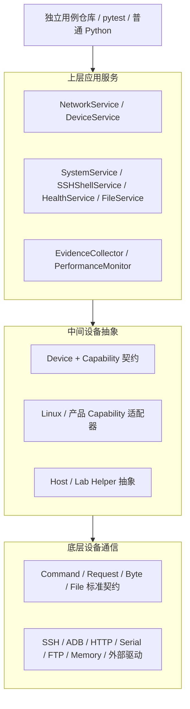

# 通用嵌入式测试框架架构与迁移说明

本次重构依据 `metool_markdownConvert.pdf` 的 21 页设计思路：复用已验证的通信实现，
建立配置驱动的运行上下文、DUT 能力模型、实验室资源管理、等待观察、诊断与测试生命周期。
PDF 对 TEnTo、ClickShare、Wave3/Wave4 的描述是参考系统的说明，不是本框架的产品需求。
其中的本地源码路径和最后的后续建议不作为可执行指令。

## 1. 三层结构与调用方向



`core` 是组合与共享设施，`wait` 是公共观察工具，`testing` 是运行器集成；它们不是额外的
设备访问层。`TestContext` 负责构造与生命周期，不承载产品业务。

服务只调用 Device 或挂在 Device 上的 Capability，不导入通信实现、不访问串口/SSH 句柄。
Capability 的实现属于设备适配层，通过 `device.execute/request/exchange/upload/download`
调用通信层。引擎不能反向依赖 Device、Service 或适配器。

`Device.channel()` 等旧 API 为兼容保留，框架服务和新用例不使用这个底层出口。
`ctx.protocols` 仅提供设备到通道名的只读清单，避免把原始引擎重新暴露给用例。
`HostService` 使用 Host 抽象，外部仪器由 `lab.Helper` 插件实现；同样不能从业务服务访问句柄。

## 2. 与 PDF 的对应关系

| PDF 思路 | 实现入口 | 行为与边界 |
| --- | --- | --- |
| Context / RuntimeConfig / ResourceRegistry（第 4–5 页） | `core/context.py`、`core/lifecycle.py` | 多设备、Helper、Service 统一构造；分层覆盖配置；资源所有权 |
| Transport / Engine（第 5–6 页） | `engine/`、`core/contracts.py` | 复用现有六种引擎；按能力提供命令、请求、字节交换、文件传输 |
| DUT（第 6–7 页） | `devices/device_base.py` | prepare、cleanup、reconnect；reboot、flash、日志、健康、崩溃能力委派 |
| Feature / Capability（第 7–8 页） | `capabilities/`、`adapters/linux.py` | 能力挂在设备上；平台命令及解析下沉到适配器 |
| Lab Helper（第 8–9 页） | `lab/`、`hosts/` | 电源、USB、显示、采集、分析、抓包、固件来源的标准接口；复用 LocalHost |
| Wait / Watch（第 9–10 页） | `wait/` | until_true/false/equal/no_exception、stays_true/equal；显式异常重试 |
| Lifecycle（第 10–11 页） | `testing/`、`pytest_plugin.py` | 保留 DeviceTestBase；新增多设备 EmbeddedTestCase、test_context fixture |
| Diagnostics（第 11–12 页） | `diagnostics/` | Artifact、日志/崩溃采集、失败证据清单、pytest 报告路径 |
| Performance（第 12 页） | `PerformanceMonitor`、`Measurement` | 有界采样、JSONL 保存、first/last/min/max/delta；阈值留在用例 |
| Factory / Plugin（第 13 页） | `Registry`、`DeviceFactory` | protocol/device/host/capability/helper/service 注册；显式加载 entry point |

PDF 列出的 Wi-Fi、蓝牙、音频、显示、安全、配对等是能力类型示例，不代表所有设备都具备。
统一扩展基类是 `Capability`；当前提供网络、日志、升级、电源、健康、崩溃、性能的标准契约。
未声明的能力抛出 `CapabilityError`，不会以空方法或默认成功伪装支持。

目前内置驱动仍是已有 SSH、ADB、HTTP、Serial、FTP、Memory。Telnet、Socket、WebSocket、
CAN、Modbus 等通过同一 Transport/Capability 注册接口接入。本次未将 PDF 中列举的所有
可选协议和仪器型号都做成未验证的内置驱动，也没有新增重型运行依赖。

## 3. 目录职责

```text
src/embedded_test_framework/
  core/          共享结果契约、配置运行上下文、资源管理、参数校验
  engine/        协议实现；he_* 为当前实现，旧文件名是兼容入口
  devices/       Device 路由、生命周期、能力挂载
  capabilities/  设备能力抽象接口
  adapters/      通用平台实现，目前提供 LinuxNetworkCapability / LinuxDevice
  services/      应用服务，每类服务单独模块
  lab/           实验室资源契约
  hosts/         已有宿主机抽象与实现
  wait/          轮询、重试观察、稳定性采样
  diagnostics/   证据与指标采集
  testing/       单设备和多设备测试基类
  config.py      稳定的配置/注册/工厂入口
  errors.py      稳定异常类型与错误码
  logging.py     日志基础设施
  pytest_plugin.py  可选 pytest 集成
configs/          配置模板
examples/external_tests/  原有兼容示例
examples/runtime_tests/   新上下文及外部适配器示例，可整体复制
device_tests/     用户维护的真实设备用例，未重写其产品配置与逻辑
unittest/         框架离线、局部通信、跨仓库集成测试
docs/             架构、行为边界与迁移说明
```

产品固件命令、寄存器协议、型号差异、特定证书及内部服务器约定放在独立插件仓库。
禁止向核心注册表硬编码项目产品名称。

## 4. 最简外部调用

```python
from embedded_test_framework import TestContext

with TestContext.from_file("runtime.json") as ctx:
    addresses = ctx.services["network"].get_ipv4_addresses("eth0")
    assert addresses
```

对应配置见 `configs/runtime.example.json`。实例化只读取配置并构建对象，进入上下文才连接设备。
同一服务不关心后面是 SSH、ADB、REST 还是产品串口协议。网卡默认值仍为 `eth0`，也可传
`eth1` 或 `wlan0`；Linux 适配器支持传 `None` 查询所有网卡。

若不使用配置式服务创建，也可以显式构造服务：

```python
from embedded_test_framework.services import NetworkService

with TestContext.from_file("runtime.json") as ctx:
    network = NetworkService(ctx.devices["dut"])
    addresses = network.get_ipv4_addresses("wlan0", timeout=5)
```

PDF 中的“先知道设备地址再查询网卡”逻辑没有变化：SSH 连接需要可达的地址或主机名，
查询服务不扫描未知设备。

## 5. 配置优先级与安全构造

合并顺序为 `defaults < 文件 < environment 映射 < CLI 映射 < testcase overrides`，
字典递归合并，标量和列表整体替换，最后解析 `${ENV_VAR}`。`environment` 是调用者显式传入的
覆盖字典；不会把整个系统环境变量隐式混入配置。

```python
ctx = TestContext.from_file(
    "runtime.json",
    environment={"inputs": {"firmware": "${BUILD_IMAGE}"}},
    cli={"devices": {"dut": {"channels": {"shell": {"host": "board-a"}}}}},
    overrides={"inputs": {"test_mode": "smoke"}},
)
```

配置接受 `devices/helpers/services/inputs/artifacts/logging`；`inputs` 存放固件引用等测试输入，
框架不猜测产品构建命名规则。`artifacts` 路径相对当前工作目录。配置不执行 Python import，
只有代码显式注册的类型可创建。

## 6. 扩展标准

新增通信协议：继承 `Transport`，实现连接和释放，再实现所需 `CommandChannel` / `RequestChannel`
/ `ByteChannel` / `FileChannel` 方法。无关能力不必实现；注册到 `register_transport`。
构造函数必须无硬件 I/O，关闭必须可重复，连接失败必须回收已创建的内部句柄。

新增设备：继承 `Device`，保持 `(name, channels, *, metadata=None, host=None)` 构造约定，
注册 `register_device`。设备特有的准备/恢复放在 prepare/cleanup 中，并调用基类方法。

新增能力：继承对应 Capability，构造参数为 `(device, **options)`，只通过 Device API 访问硬件。
注册 `register_capability` 后在设备配置的 `capabilities` 中指定 type。
配置能力可以覆盖 LinuxDevice 预置的 network 实现。

新增仪器：继承 `Helper` 或其标准子类，构造参数 `(context, **options)`，prepare 获取资源，
cleanup 恢复并释放。需要协议的仪器通过 context 中独立配置的设备访问；Helper 准备阶段如需
使用该设备，在 Helper 配置中声明 `"requires": ["instrument"]`。上下文先准备该依赖设备，
再准备 Helper；退出时先恢复 Helper，最后关闭依赖设备。资源由上下文单独所有，不能共享底层句柄。
通用 Helper 不强制电源重置、不主动终止已有应用；恢复逻辑由具体适配器定义。

新增服务：构造参数 `(device, **options)`，注册 `register_service`。服务为无独立资源的工作流；
有状态资源由 Device 或 Helper 管理。

外部插件可以显式调用 `register(registry)`，或安装 entry point：

```toml
[project.entry-points."embedded_test_framework.plugins"]
my_lab = "my_lab.plugin:register"
```

```python
registry = Registry.defaults()
registry.load_plugins(["my_lab"])
ctx = TestContext.from_file("runtime.json", registry=registry)
```

插件代码是可信扩展，加载是显式代码操作，不从 JSON 自动执行。完整适配器示例在
`examples/runtime_tests/product_adapters.py`，包括两种网络数据格式、日志、指标和模拟 Helper。

## 7. 生命周期与恢复

准备顺序：配置顺序中的 Helper，然后配置顺序中的 Device；Helper 声明的 `requires` 设备
在该 Helper 之前准备，每台设备只准备一次。清理严格逆序。
资源在 prepare 调用前登记，因此部分初始化失败也参与回收。
任何清理失败都会继续尝试其他资源；若已有测试异常，清理错误写入异常 note，不覆盖原始失败。

`Device.prepare/cleanup` 默认兼容 `connect/close`。`reconnect()` 显式关闭再连接，
不重放上一条命令。框架不会自动重复升级、重启、上传或其他写操作。
协议超时后是否恢复、是否允许重试由调用者根据操作幂等性决定；可先显式 reconnect，
再通过 `DeviceService.wait_ready()` 检查设备健康能力。

| 错误码 | 异常 | 调用方处理 |
| --- | --- | --- |
| CONFIGURATION_ERROR | ConfigurationError | 修正配置/注册，不重试 |
| TRANSPORT_ERROR | TransportError | 检查底层原因，按协议显式恢复 |
| DEVICE_DISCONNECTED | DeviceDisconnected，继承 TransportError | 重连；重新判断写操作是否已执行 |
| OPERATION_TIMEOUT | OperationTimeout，仍继承 TransportError 和 TimeoutError | 调整预算/恢复连接；不可假定操作未执行 |
| COMMAND_FAILED | CommandFailed，继承 TransportError | 从 result/exit_code 获取返回信息，修正命令或设备状态 |
| CAPABILITY_UNAVAILABLE | CapabilityError | 安装/注册正确适配器或在用例中跳过不支持的能力 |
| OBSERVATION_FAILED | ObservationFailed，兼容 AssertionError | 稳定性观察不满足预期 |
| CLEANUP_FAILED | CleanupError | 检查 errors，确认外部资源恢复情况 |

日志记录操作名、异常类型与错误码，不记录命令、凭据、完整配置或异常正文。
SSH/FTP 的已识别超时保留 `OperationTimeout`；SSH 会话失效及 FTP 传输连接丢失报告断连。
其他协议错误仍保留原有 `TransportError` 和 `__cause__`。

## 8. 等待、性能、诊断

`wait.until_true/false/equal` 默认不吞异常；只重试 `exceptions=` 中显式列出的类型。
`until_no_exception` 需要显式指定异常类型。`stays_true/equal` 在观察窗口内按间隔采样，
首次不满足条件即失败。它不是连续硬件监控，也不是后台异步任务。

轮询使用单调时钟；晚于截止时间返回的成功不能当作按时成功。Python 回调本身无法被强制中断，
调用者应给底层操作设置 timeout。性能 sample 同样应由适配器设置通信预算。

`EvidenceCollector` 调用设备的 logging/crash 能力，保存唯一目录中的 manifest；一个来源失败
不阻止其他来源。未支持、采集成功、采集失败分别记录。设备名称不直接参与目录拼接。
日志及其他内容是否含敏感信息由产品采集器控制。

`PerformanceMonitor.record()` 通过 performance 能力采样，输出 Measurement 和可选 JSONL。
trend 只计算趋势，不把产品阈值塞进核心。视频、截图、coredump 等可由 logging 能力采集到
目标目录，或扩展专门采集器；本框架不假定设备自带这些工具。

## 9. pytest 与旧接口迁移

原 `dut` fixture、`DeviceTestBase`、`load_device`、`Device`、引擎构造签名和服务签名继续可用。
`engine.command/ftp/http/serial` 是 `he_*` 的兼容模块，旧 import 和 monkeypatch 路径仍指向
同一实现。`CommandResult` / `HttpResponse` 的旧导入路径保留，未更改数据字段。

`SSHShellService.get_ipv4_addresses(interface="eth0", *, command="ifconfig", include_loopback=False,
timeout=None)` 保留完整签名；内部由设备层 Linux 适配器执行。它是旧的显式 shell API，
新跨设备用例优先使用 `NetworkService`。

旧 `load_device` 继续读取单设备 inventory；新 `TestContext.from_file` 读取完整 runtime。
新旧配置入口区分明确，不会改变旧入口对未知字段的校验。

多设备用例使用 `test_context` fixture，或继承 `EmbeddedTestCase`，通过 `self.context` 获取
设备/服务/Helper。`self.device` 仍指向 `device_name` 指定的设备。
保留 setupclass/setup/teardown/teardownclass 产品钩子。

启用 `embedded_test_framework.pytest_plugin` 后，测试失败自动收集证据，路径追加到 pytest
报告 section。断言失败发生在 teardown 前，采集可以使用仍然连接的设备。
setup 已发生回滚、teardown 已断连时，采集可能失败，此情况如实记录，不覆盖原测试失败。

```powershell
python -m pytest --device-config runtime.json --artifact-dir reports/evidence
```

`--runtime-override` 接受 JSON 对象。覆写 `runtime_overrides` fixture 可提供优先级更高的
用例配置。普通 Python 的 `with TestContext(...)` 出现异常也会采集证据后再清理。

## 10. 验证与实际设备边界

回归覆盖旧 API、外部 Capability 适配器、多设备回滚、Helper 清理、配置覆盖、等待预算、
诊断来源失败、pytest 独立子进程、模块依赖边界以及包外示例调用。

```powershell
python -m pytest unittest
python -m pytest examples/external_tests --device-config examples/external_tests/devices.json
python -m pytest examples/runtime_tests --device-config examples/runtime_tests/devices.json
python -m pip wheel . --no-deps --no-build-isolation -w dist
```

本次未连接真实板卡、刷写固件或操控实际仪器。真实设备配置和用户维护的测试逻辑保留。
当前工作区密码 SSH 的 AutoAddPolicy 也保留，旧测试替身已补齐该策略接口；
密钥/agent 路径继续使用现有 OpenSSH 行为。新功能没有要求新增核心运行依赖。
