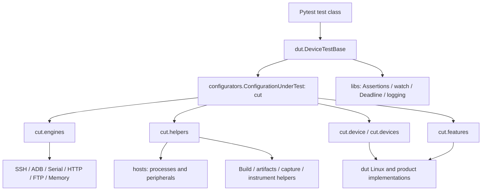

# Architecture and ownership

The directory layout implements the supplied test-class / ConfigurationUnderTest diagram using reusable Python components.

## Responsibilities

- `configurators` loads trusted Python or JSON configuration, selects registered factories, builds resources, and manages dependencies. It contains the runtime implementation; no separate core package is needed.
- `dut` owns devices and test-class setup/teardown. Product workflows live in `dut/services`; Linux network/reboot logic stays in `dut/linux_device.py`.
- `engine` contains protocol implementations. It depends only on shared libraries, not DUTs or helpers.
- `helpers` provides reusable Linux, Valgrind, QR, build, artifact and evidence functions. Instrument contracts specify behavior without pretending that an unimplemented USB switcher or capture device is working.
- `hosts` contains all host-specific behavior, including applications, peripherals and driver state.
- `libs` supplies result/contracts, assertions, address checks, polling, deadlines, logging and resource ownership primitives.
- `tools` is intentionally empty.

## Resource ownership

Configuration construction must not connect hardware. `cut.prepare()` prepares registered helpers and devices, and rolls back attempted resources on failure. Device dependencies declared by a helper are opened first and closed after that helper. Otherwise helpers prepare before the DUT and release after it. Cleanup attempts remaining resources even when one cleanup fails.

`cut.engines.shell` and `cut.device.engines['shell']` refer to the same engine. A borrowed convenience view never owns a second connection. `cut.helpers.host` is owned by the selected device unless the caller explicitly supplied a shared host. Registered helper cleanup occurs once per prepared lifecycle; repeated cut closure does not repeat a registered helper's cleanup.

`cut.features` exposes only bound device features. The screenshot's product-specific device families and workflows should be subclasses/plugins in the consuming repository. They are not hardcoded into this SDK.

## Configuration boundaries

Python `testconfig.py` executes trusted code. It must not be accepted from untrusted uploads or remote users. JSON files remain data-only. Environment placeholders are resolved after configuration merging. Registry plugins are explicitly selected by trusted application code; configuration never names arbitrary imports.

The flat Python format supports `DEVICE_NAME`, `DEVICE_TYPE`, `METADATA`, `LOGGING`, `HOST`, `SSH`, `SERIAL`, `ADB`, `FTP`, `HELPERS`, `SERVICES`, `INPUTS`, and `ARTIFACTS`. A full `TEST_CONFIG` mapping takes precedence. FTP paths are metadata until a test explicitly requests a transfer.

## Verification

`unittest/` checks engine failures, resource ordering, repeated setup/teardown, configuration validation, framework logging and isolation from external test repositories. The external examples use memory devices and local processes. Hardware examples are collected separately and are never part of the Jenkins offline suites.
